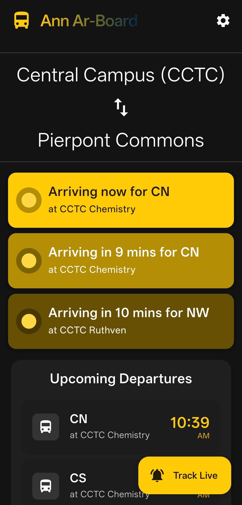
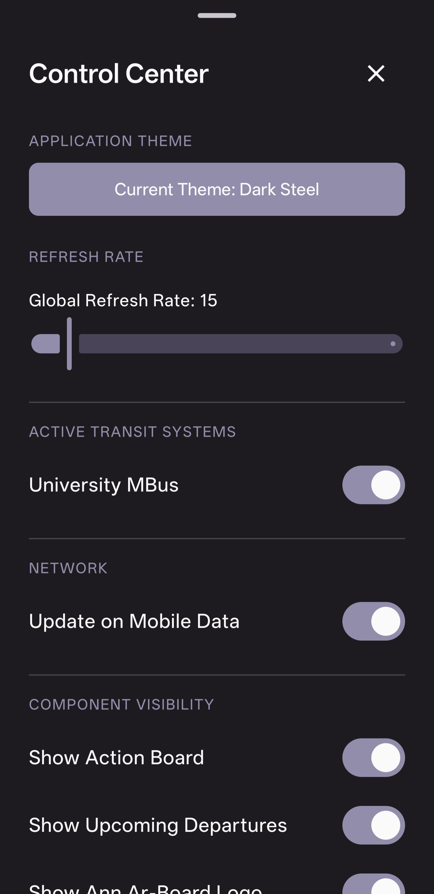
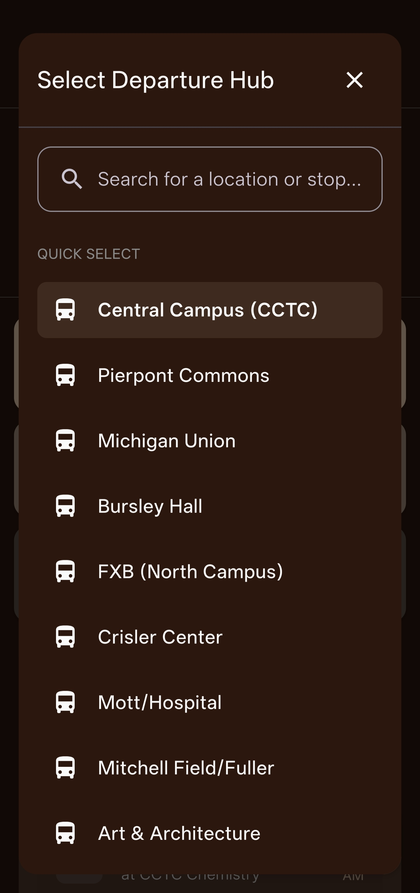
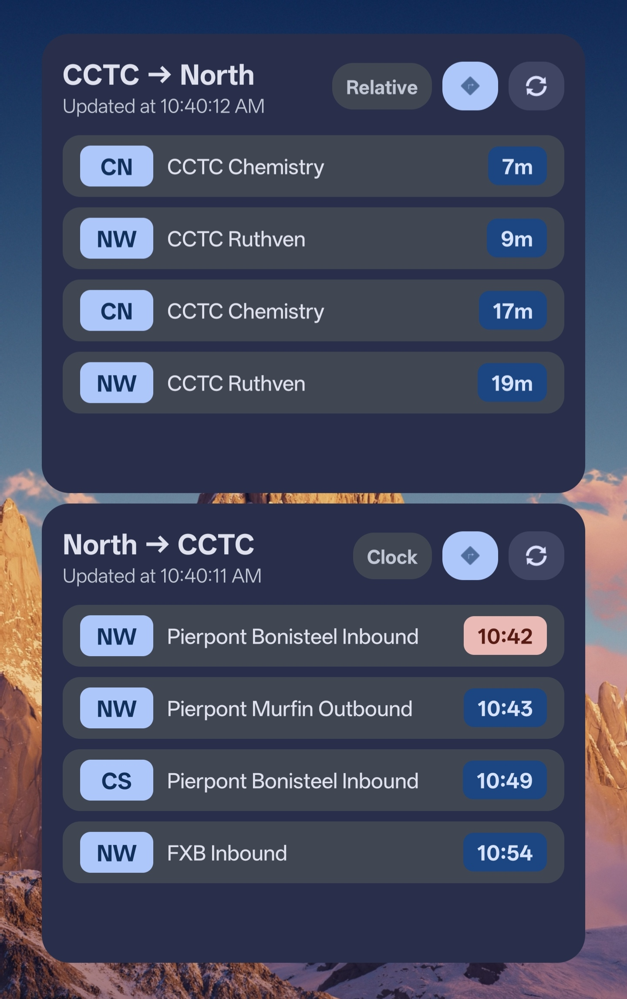
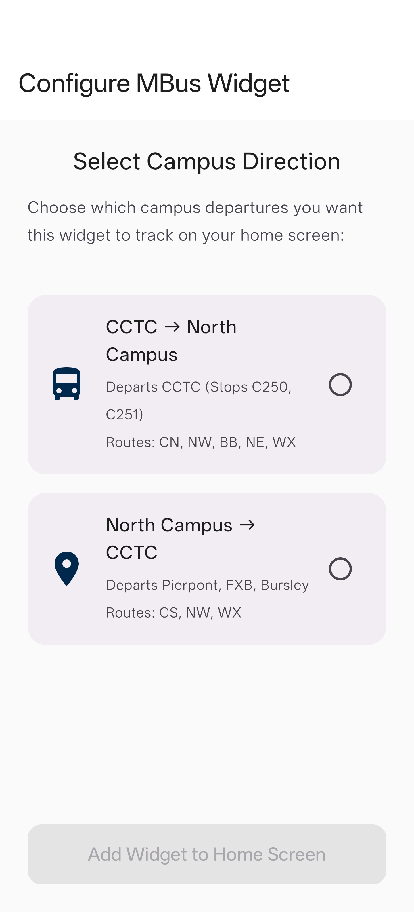
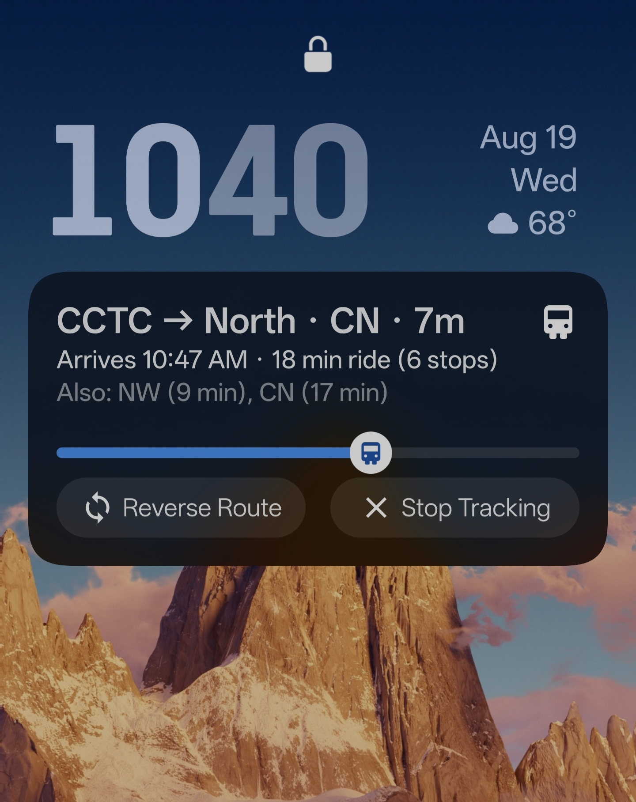

# Ann Ar-Board Mobile

[](https://developer.android.com)
[](https://kotlinlang.org)
[](https://developer.android.com/jetpack/compose)

Welcome to **Ann Ar-Board Mobile**, the official native Android application for **Ann Ar-Board**—a real-time transit departure dashboard designed for the University of Michigan and Ann Arbor bus networks.

Built with **Kotlin**, **Jetpack Compose**, **Material 3**, **Jetpack Glance**, and **Android Foreground Services**, this mobile application brings real-time U-M MBus tracking directly to your Android device, home screen widgets, and notification shade.

---

## 📸 Screenshots

<div align="center">
  <table>
    <tr>
      <td align="center" valign="top" width="33%">
        <strong>Main Dashboard</strong><br><br>
        
      </td>
      <td align="center" valign="top" width="33%">
        <strong>Control Center</strong><br><br>
        
      </td>
      <td align="center" valign="top" width="33%">
        <strong>Hub Selector Modal</strong><br><br>
        
      </td>
    </tr>
    <tr>
      <td align="center" valign="top" width="33%">
        <strong>Home Screen Widget</strong><br><br>
        
      </td>
      <td align="center" valign="top" width="33%">
        <strong>Widget Configuration</strong><br><br>
        
      </td>
      <td align="center" valign="top" width="33%">
        <strong>Live Notification</strong><br><br>
        
      </td>
    </tr>
  </table>
</div>

---

## ✨ Features

* **Real-Time Departure Board:** Live tracking of U-M MBus routes with instant predictions, countdown timers, and stop filtering.
* **Hub-to-Hub Action Board:** Smart transit logic automatically pairs origin and destination hubs (e.g., CCTC ⇄ Pierpont Commons, Union, Bursley, Hospital, etc.) to highlight the best routes for quick commutes.
* **Home Screen Widget (Jetpack Glance):** Modern Android Glance widget providing live bus arrival predictions right on your home screen with one-tap refresh and direction toggling. Includes a dedicated setup activity (`WidgetConfigureActivity`).
* **Persistent Live Notification Service:** Start live tracking to pin an active foreground service notification (`TrackingService`) in your notification shade. Features a dynamic countdown timer, route cycling, direction reversal, and arrival progress bar without opening the app.
* **Configurable Auto-Refresh:** Adjustable global background polling interval (from 3s up to 120s) with live animated sync indicators and stale data warnings.
* **Modern Edge-to-Edge Material 3 UI:** Built entirely with Jetpack Compose featuring smooth animations, dark/light theme switching, and custom palette options.

---

## 🎨 Control Center & Customization

Customize your transit tracking experience through the built-in Control Center:

* **Theme Selector:** Switch between Dynamic Material You, dark, light, and custom color themes.
* **Refresh Rate Slider:** Fine-tune polling frequency to balance data accuracy and battery life (3s – 120s).
* **Component Toggles:** Enable or disable the Action Board, Upcoming Departures, FAB buttons, and Sync status headers.
* **Legibility Controls:** Toggle 24-hour clock formatting, integrated/split stop views, and display item caps (1–15 buses).
* **Network & Data Saver:** Option to pause auto-updates when on mobile data.
* **Developer Simulation Mode:** Built-in simulated data toggle for offline testing and UI development.

---

## 🛠️ Architecture & Tech Stack

* **Language:** 100% Kotlin
* **UI Framework:** Jetpack Compose with Material 3 components
* **App Widgets:** Android Jetpack Glance (`androidx.glance`)
* **Background Service:** Android Foreground Service with custom `RemoteViews` notifications
* **Networking:** Retrofit 2 + Gson Converter communicating with the [Ann Ar-Board Vercel Backend](https://ann-ar-board.vercel.app/)
* **Asynchronous Processing:** Kotlin Coroutines & `Flow`
* **Local Storage:** `SharedPreferences` & Jetpack DataStore (for Glance Widget state)

> **🔒 Security Note:** The mobile app communicates directly with the serverless API proxy (`https://ann-ar-board.vercel.app/api/mbus/predictions`), keeping API keys and secrets securely isolated on the backend server.

---

## 🚀 Building & Running Locally

### Prerequisites

* **Android Studio** (Ladybug / Jellyfish or newer recommended)
* **Android SDK** API Level 36 (Minimum supported SDK is API 28 / Android 9.0)
* **JDK 11** or higher

### 1. Clone the Repository

```bash
git clone https://github.com/secondjb/AnnArBoard-Mobile.git
cd AnnArBoard-Mobile
```

### 2. Open in Android Studio

1. Launch Android Studio.
2. Select **Open** and choose the `mobile` directory.
3. Allow Gradle to sync dependencies.

### 3. Build & Run

Connect an Android device (with USB debugging enabled) or start an Android Emulator, then:

* **In Android Studio:** Press `Shift + F10` (or click **Run 'app'**).
* **Via Command Line (Gradle Wrapper):**

  ```bash
  # On Windows (PowerShell)
  .\gradlew.bat assembleDebug

  # Install directly to attached device
  .\gradlew.bat installDebug
  ```

---

## 🔮 Future Development

* **TheRide (AAATA) City Bus Integration:** Expanding API support to include Ann Arbor Area Transportation Authority routes alongside U-M campus buses.
* **Interactive Map View:** Adding an integrated route map view for real-time bus locations.
* **Custom Route Alarms:** Setting push notification alerts when your bus is arriving soon.

---

_Based on the original [Ann Ar-Board](https://github.com/secondjb/Ann-Ar-Board) web dashboard created for ENGR100 at the University of Michigan._
